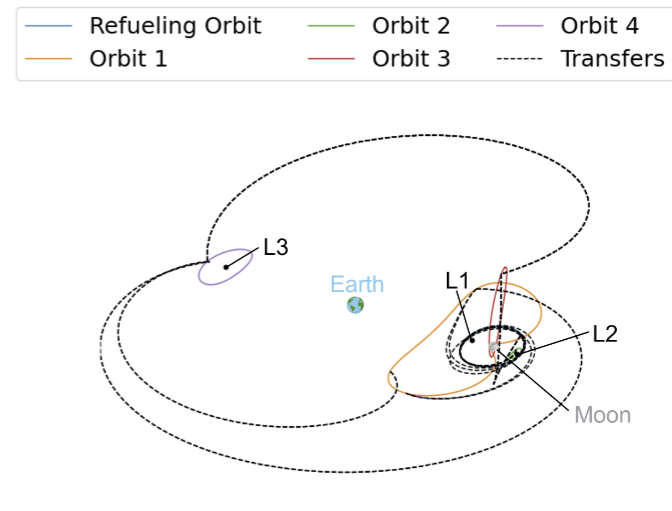

---
 

# My Stuff

    <h2>CMBverse</h2>
    
    <a href="projects/CMBvar.html">Project Page</a>

    <h2>Balancer Robot</h2>
    
    <a href="projects/Balance_Bot.html">Project Page</a>

    <h2>Neptune Lawncare Project</h2>
    
    <a href="projects/Neptune.html">Project Page</a>

    <h2>MNIST Scratch Neural Net</h2>
    
    <a href="https://github.com/igobyjack/scratch-net">https://github.com/igobyjack/scratch-net</a>

    <h2>Monte-Carlo pi solver</h2>
    
    <a href="https://github.com/igobyjack/monte-carlo-pi">https://github.com/igobyjack/monte-carlo-pi</a>

    <h2>Discord Stock Exchange</h2>
    
    <a href="https://github.com/igobyjack/Discord-Stock-Exchange">https://github.com/igobyjack/Discord-Stock-Exchange</a>

---

# Research

 

    <h2>Optimal Multi-Spacecraft Refueling Planning for Cislunar Operations</h2>
    
    <h2>Abstract</h2>
    
As space activities expand within the cislunar environment,
    developing efficient refueling strategies becomes essential
    for sustaining long-term missions. The multi-spacecraft
    refueling problem focuses on optimizing fuel consumption to
    extend mission lifetimes. A multi-fidelity modeling approach
    addresses varying levels of precision, using the two-body problem
    for initial trajectory estimation, the circular restricted
    three-body problem for reference orbits and transfers, and
    the bicircular restricted four-body problem with solar radiation
    pressure for realistic station-keeping costs. The refueling
    problem is formulated as an infinite-horizon Markov decision
    process (MDP), optimizing the refueling strategy while preventing
    fuel depletion. The refueling process consists of two
    phases: first, the refueler transfers into a temporary phasing
    orbit, followed by a final phasing maneuver to rendezvous with
    the target spacecraft. We map the available transfers between
    orbits using a fast sampling technique and select the phasing
    orbit to minimize fuel consumption within a limited synodic
    period. The case study samples orbits from the Lyapunov and
    Halo families around the Lagrange points of the Earth-Moon
    system, L1, L2, and L3. Simulations demonstrate that the MDPbased
    planning achieves a 36% reduction in fuel consumption
    compared to a greedy strategy.

<h2><a href="assets/paper/Optimal_Multi-Spacecraft_Refueling_Planning_Cislunar.pdf" download>Link</a></h2>

 