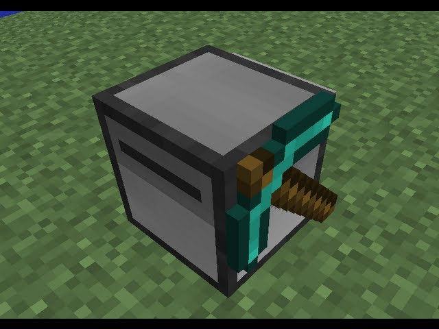

---
 

# Projects

 

    <h2>Neptune Lawncare Project</h2>
    
    <a href="projects/Neptune.html">Project Page</a>

    <h2>CMBverse</h2>
    
    <a href="projects/CMBvar.html">Project Page</a>

    <h2>MNIST Scratch Neural Net</h2>
    
    <a href="https://github.com/igobyjack/scratch-net">https://github.com/igobyjack/scratch-net</a>

    <h2>Monte-Carlo pi solver</h2>
    
    <a href="https://github.com/igobyjack/monte-carlo-pi">https://github.com/igobyjack/monte-carlo-pi</a>

    <h2>Discord Stock Exchange</h2>
    
    <a href="https://github.com/igobyjack/Discord-Stock-Exchange">https://github.com/igobyjack/Discord-Stock-Exchange</a>

    <h2>Turtle Craft (WIP)</h2>
    
    <a href="https://github.com/igobyjack/turtle-craft">https://github.com/igobyjack/turtle-craft</a>

 

---

# Research

 

Coming soon...

 